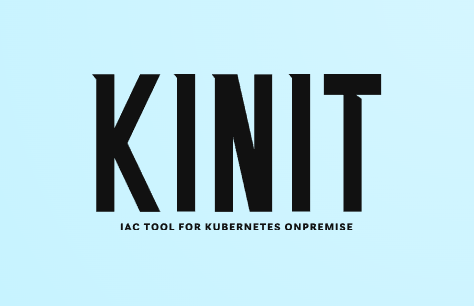

<a id="readme-top"></a>

[![Contributors][contributors-shield]][contributors-url]
[![Forks][forks-shield]][forks-url]
[![Stargazers][stars-shield]][stars-url]
[![Issues][issues-shield]][issues-url]
[![License: BSD 3-Clause][license-shield]][license-url]

<br />
<div align="center">
  <a href="https://github.com/othneildrew/Best-README-Template">
    
  </a>
</div>

## Overview

Kinit is a powerful, open-source Infrastructure as Code (IaC) tool designed to simplify the deployment of on-premise Kubernetes clusters. It eliminates the complexities of manual setup, allowing you to build a production-ready cluster with minimal effort.

Kinit streamlines the entire process into a few simple steps:

1. <ins>Meet the Prerequisites:</ins> Ensure you have the minimal infrastructure required, as outlined in the Prerequisites section.

2. <ins>Fill out the Form:</ins> Use our intuitive UI to define your cluster's specifications.

3. <ins>Deploy:</ins> Kinit handles the rest, automating the entire cluster creation process.

With Kinit, building a Kubernetes cluster is as easy as filling out a form, making advanced infrastructure accessible to everyone.

### Choose Your Container Runtime

Kinit gives you the flexibility to build your cluster with the container runtime that best fits your needs. You can easily choose between:

- Docker 🐳

- Containerd 📦

- CRI-O 🐧

### Tailor Your Infrastructure for High Availability

Beyond container runtimes, Kinit lets you select the cluster configuration that aligns with your specific high-availability (HA) and reliability requirements.

#### Simple Configuration

This is a standard setup with a single control plane. It’s an ideal solution for development, testing, or scenarios where high availability isn't the primary concern. It provides a solid, minimal-footprint cluster that's quick to deploy and easy to manage.

#### Stacked ETCD Configuration

For environments that demand high availability, the Stacked ETCD configuration is the perfect choice. This setup features multiple control planes, with leader election managed automatically via Keepalived. It's a robust solution for a production workload where you need HA without the overhead of a massive infrastructure.

## Getting Started

Once your infrastructure is in place, the cluster creation process is streamlined. Minimal configuration is required on the virtual machines themselves; the primary task is to ensure they meet the following technical specifications.

### Prerequisites

This project requires a pre-configured infrastructure of virtual machines that adhere to the following technical prerequisites:

<ins>Network Configuration:</ins> All virtual machines must have a static IP address assigned to a single, shared network. This ensures consistent and reliable inter-node communication.

<ins>User and Permissions:</ins> A unique user account with identical credentials and sudo privileges must exist across all virtual machines.

<ins>Minimum System Requirements:</ins> Each virtual machine must meet or exceed the following specifications to function optimally as a Kubernetes node:

- <b>CPU:</b> 2 vCPUs

- <b>RAM:</b> 2 GB

- <b>Storage:</b> 25 GB of available disk space

### Installation

`Kinit` can be executed from any environment with network access to your target virtual machines, including a separate host or one of the VMs destined to be a Kubernetes node.

For optimal performance and minimal latency, it's recommended that you run Kinit directly from the machine designated as your primary master node.

1. <b>Clone the Repository</b>

   First, connect to your target node and clone the Kinit repository.
   ```sh
   git clone https://github.com/franconte98/Kinit.git
   ```
2. <b>Grant Execution Permissions</b>

   Navigate into the newly created Kinit directory and grant execute permissions to the main script.
   ```sh
   cd Kinit && chmod +x start.sh
   ```
3. <b>Execute the Script (as ROOT)</b>

   Run the start.sh script to begin the setup process as ROOT.
   ```sh
   ./start.sh
   ```
4. <b>Follow the On-Screen Prompts</b>

   The script will guide you through a series of prompts to configure and deploy your desired Kubernetes infrastructure. Simply follow the instructions displayed in your terminal.

## Usage

`Kinit` is a versatile tool designed to handle both cluster creation and node joining.

- <b>To Create a Cluster:</b> Run Kinit from a machine on the same network as your virtual machines. The script will guide you through the process of setting up your desired cluster topology.

- <b>To Join a Node:</b> Execute Kinit directly on the node you wish to add to an existing cluster. Follow the on-screen prompts and select the "Join" option when prompted.

## About Kinit

`Kinit` offers a unique approach to on-premise Kubernetes deployment. Unlike solutions that abstract away the cluster's core components, `Kinit` utilizes kubeadm to create a standard, vendor-neutral Kubernetes cluster. This means your cluster is built with the same robust tools you would use for a manual configuration, guaranteeing long-term stability and compatibility with the wider Kubernetes ecosystem.

This method provides two key advantages:

<b>Transparency:</b> You get a standard kubeadm cluster, not a custom-built solution, making it easier to troubleshoot and manage.

<b>Minimalism:</b> Kinit avoids unnecessary software, focusing on a lean and efficient cluster that's production-ready out of the box.

Additionally, Kinit installs a curated selection of minimal yet extremely useful tools to extend your cluster's capabilities:

- <ins>k9s:</ins> A terminal-based UI to interact with your Kubernetes cluster. It provides a real-time, intuitive interface for managing applications and resources.

- <ins>NGINX Ingress Controller:</ins> An Ingress controller that uses a standard NGINX web server to provide HTTP and HTTPS routing to services within your cluster.

- <ins>KGateway:</ins> An open-source, lightweight API gateway for Kubernetes.

- <ins>MetalLB:</ins> A load-balancer implementation for bare metal Kubernetes clusters. It provides a network load-balancer using standard routing protocols.

- <ins>Weave:</ins> A simple and lightweight networking solution that creates a virtual network connecting all your Kubernetes pods. It is used as the Container Network Interface (CNI).

## License

Distributed under the BSD-3-Clause license License. See `LICENSE` for more information.

[contributors-shield]: https://img.shields.io/github/contributors/franconte98/Kinit.svg?style=for-the-badge
[contributors-url]: https://github.com/franconte98/Kinit/graphs/contributors
[forks-shield]: https://img.shields.io/github/forks/franconte98/Kinit.svg?style=for-the-badge
[forks-url]: https://github.com/franconte98/Kinit/forks
[stars-shield]: https://img.shields.io/github/stars/franconte98/Kinit.svg?style=for-the-badge
[stars-url]: https://github.com/franconte98/Kinit/stargazers
[issues-shield]: https://img.shields.io/github/issues/franconte98/Kinit.svg?style=for-the-badge
[issues-url]: https://github.com/franconte98/Kinit/issues
[license-shield]: https://img.shields.io/badge/License-BSD%203--Clause-blue.svg?style=for-the-badge
[license-url]: https://github.com/franconte98/Kinit/blob/main/LICENSE
[product-screenshot]: images/screenshot.png